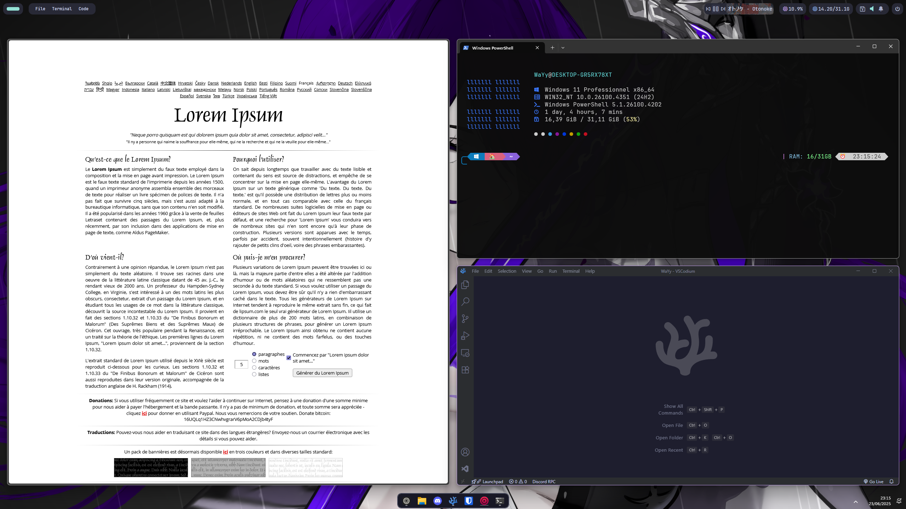

<h1 align="center"> 👺 Windows 11 </h1>

This project is also available on my self-hosted [Gitea instance](https://git.wayy.fr/WaYy/dotfiles), where it is updated more frequently than on GitHub for convenience.

 

🪟 Preview

 
 

## 🛠️ System Configuration

Core components used to personalize the look and behavior of Windows 11:

- **📌 Topbar:** [Yasb](https://github.com/amnweb/yasb) -> [config](configs/yasb/)
- **📂 StartMenu:** [Windhawk](https://windhawk.net/) -> [config](configs/windhawk/)
- **🪟 Window Manager:** [GlazeWM](https://github.com/glzr-io/glazewm) -> [config](configs/glazewm/)
- **🖱️ Cursor:** [Minimalistic](https://www.deviantart.com/skyeo84/art/Minimalistic-V3-nord-cursor-909562097) -> [config](configs/cursor/Minimalistic_V3_nord/)

## 🧰 Applications Used

Main software used for productivity and desktop experience:

- **🔉 Music:** [cider](https://cider.sh/)
- **🧱 Browser:** [zen browser](https://github.com/zen-browser/desktop)
- **⌨️ Code Editor:** [Vscodium](https://github.com/VSCodium/vscodium)
- **🃏 Live Wallpaper:** [Wallpaper Engine](https://store.steampowered.com/app/431960/Wallpaper_Engine/)

## 🖥️ Terminal

Command-line tools and prompt customization used to enhance developer workflow:

- **🔧 Git:** [Git](https://git-scm.com/) → [config](configs/git/)
- **⚡ Fastfetch:** [Fastfetch](https://github.com/fastfetch-cli/fastfetch) → [config](configs/fastfetch/)
- **🎨 Oh My Posh:** [OhMyPosh](https://ohmyposh.dev/) → [config](https://github.com/ChrisTitusTech/powershell-profile)
- **📄 PowerShell Profile:** [config](configs/powershell/)

## 📚 Credits

This setup is the result of exploring and experimenting with a wide range of Windows dotfiles and configurations shared by the community. I drew inspiration from many sources before shaping something that truly fits my workflow and aesthetic.

Special thanks to:

- [KaiScripted](https://github.com/KaiScripted/dotfiles)
- [ashish0kumar](https://github.com/ashish0kumar/windots)
- [elrondforwin](https://github.com/elrondforwin/dotfiles)
- [Darsh-A](https://github.com/Darsh-A/Win-Rice)
- [jade-tam](https://github.com/jade-tam/dotfiles)

  your work was incredibly helpful and inspiring.
